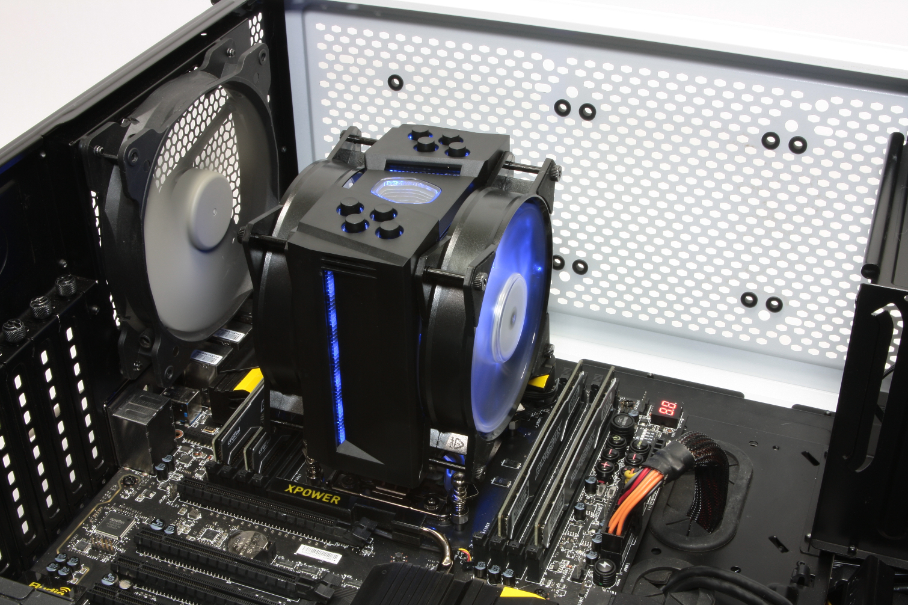
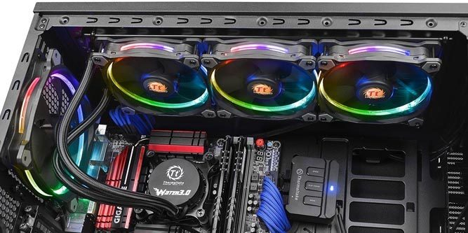

# CPU Cooler
## A CPU cooler is used to dissapate heat from the CPU. There are two main forms of CPU coolers: Air Cooler and Liquid Cooler.

**Air Cooler**  
An Air Cooler relies on its heatsink and fan(s) to remove heat from the CPU. The heat travels through the heatsink and the 
heatsink is cooled by the included fans.
  

**Liquid Cooler**  
A Liquid Cooler uses a liquid that travels in a closed looped to remove heat from the CPU. The liquid travels along the loop and heats the CPU 
cooling it off. Then the hot liquid goes back through the radiator to dissapate the heat and goes back to the CPU.  

Generally, liquid coolers are able to outperform air coolers, but come at a higher cost. However, higher end air coolers are able to compete with liquid 
coolers.

[Return to Home](https://github.com/rhd45-edu/IT-1600-Final-Project#readme)  
[Previous Part: CPU ](cpu.md)  
[Next Part: Motherboard ](motherboard.md)  

