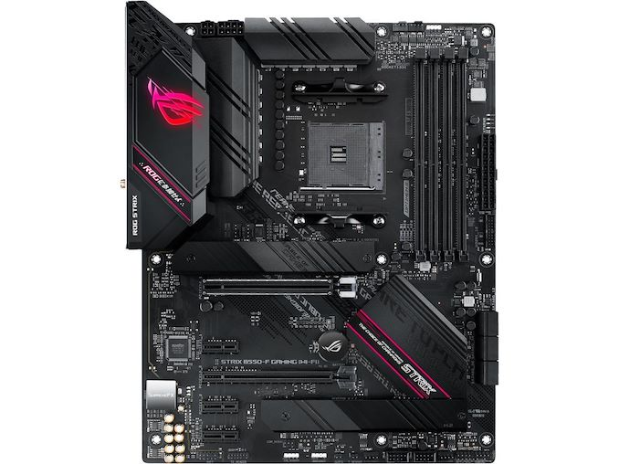

# Motherboard 
## A motherboard connects all of the parts together to a computer and allows them to communication with each other.  

Motherboards can come in a variety of sizes, so it is important to ensure that the case you use can support the motherboard. Motherboards vary between 
support for Intel or AMD CPUs. Motherboards start to increase in price as more ports,better thermal designs, and more features are added.  

[Return to Home](https://github.com/rhd45-edu/IT-1600-Final-Project#readme)  
[Previous Part: CPU Cooler ](cpucooler.md)  
[Next Part: Memory ](memory.md)  
