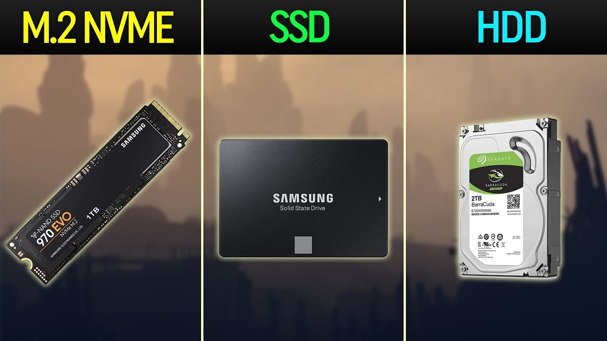

# Storage
## Storage Devices allow for important files to be saved even after the computer is shutdown/loses power. There are three main types of storage: HDD, SSD, and M.2.

**HDD (Hard Disk Drive)**
A HDD is the slowest of the three drives. A HDD writes to memory on a physical disk which leads to slower storage and retrieval.  
**SSD (Solild State Drive)**
A SSD is the second fastest of the three drives. An SSD writes memory to chips that allow for faster storage and retrieval.  
**M.2**
A M.2 is the fastest of the three drives. It connects directly to the motherboard which allows for faster transfer speeds than an SATA SSD.

[Return to Home](https://github.com/rhd45-edu/IT-1600-Final-Project#readme)  
[Previous Part: Memory ](memory.md)  
[Next Part: Video Card ](videocard.md)  
