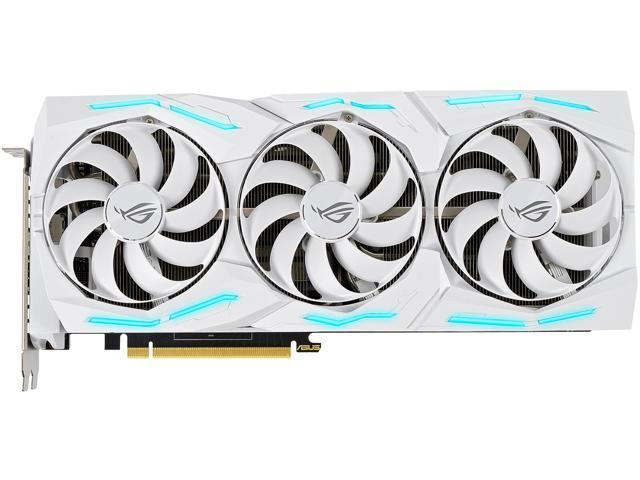

# Video Card
## A video card is used to display an image on the display and render out graphical images.

One function of the video card is to render the graphics for the games we play. The more demanding a game, the more demanding it is on the GPU.  
As a result, you may need to spend more money in this department in order to play games smoothly.

[Return to Home](https://github.com/rhd45-edu/IT-1600-Final-Project#readme)  
[Previous Part: Storage](storage.md)  
[Next Part: Case](case.md)  
